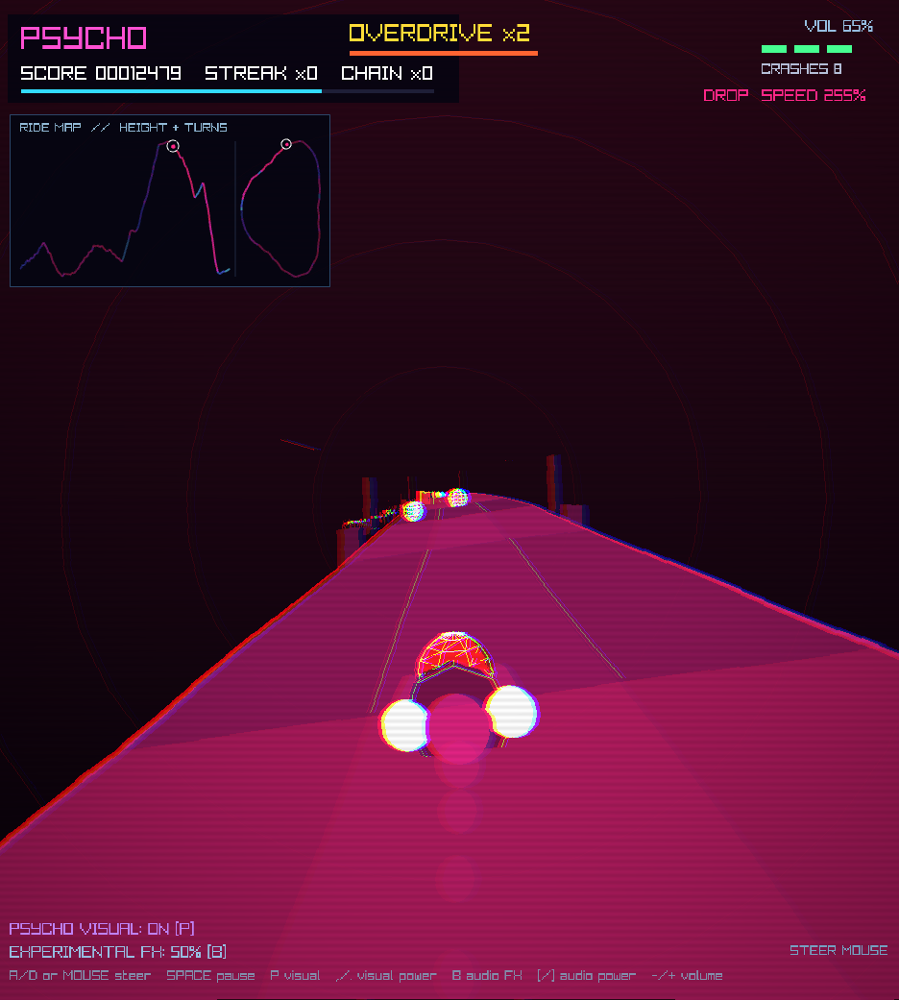
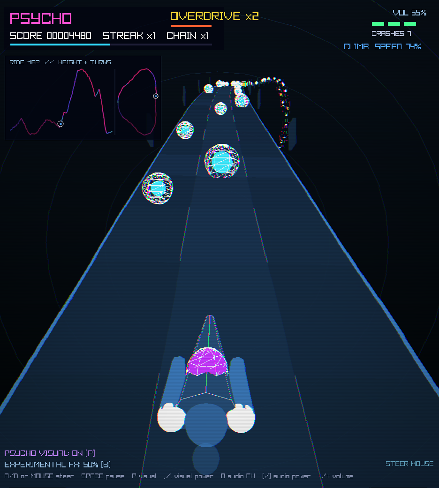
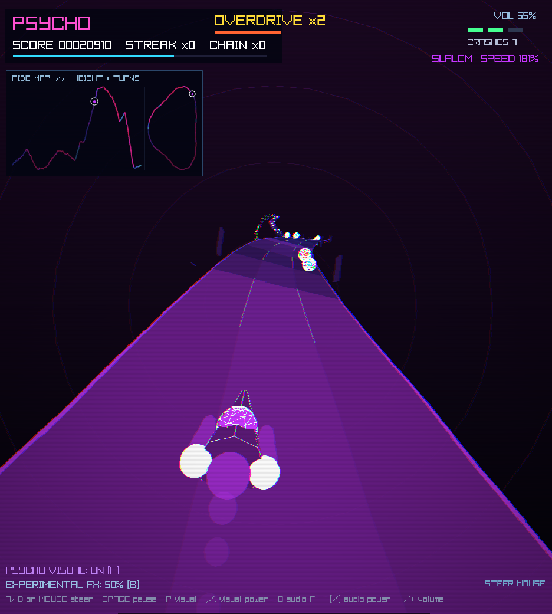
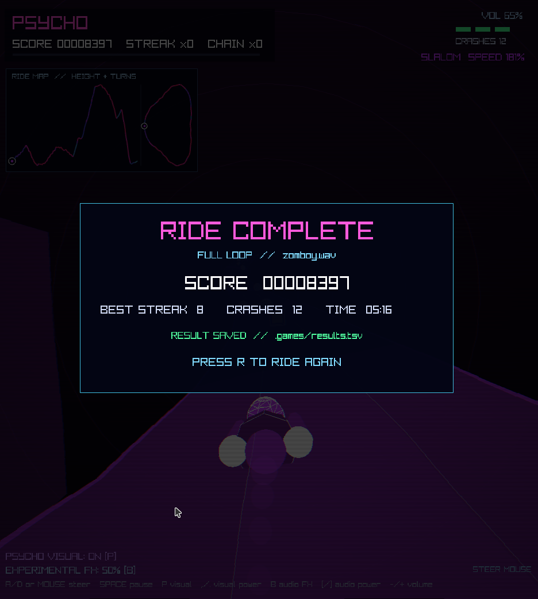

<h1 align="center">PSYCHO</h1>

<p align="center">
  <strong>Your music becomes a psychedelic roller coaster.</strong><br>
  An audio-reactive puzzle racer written in Odin with raylib.
</p>

<p align="center">
  
</p>

PSYCHO listens to a song before the ride begins, then composes a complete 3D
track from its rhythm, spectrum, dynamics, and tempo. Quiet passages climb in
cool colors. Dense, energetic sections dive, accelerate, and burn hot. Every
song becomes one closed-loop course whose final curve returns to its beginning.

The result is not a waveform with a car on top. It is a cached, explorable road:
sweeping turns, hills, drops, banking, traffic, hazards, boosts, and a live map
of the entire ride.

## The ride

- **Music becomes motion.** Bass, mids, highs, transients, beat density, tempo,
  and song-relative energy influence the route, grade, speed, palette, camera,
  and traffic.
- **The sky performs too.** Procedural neon ribbons, stars, rays, glow, and tunnel
  rings react independently to bass, mids, highs, onsets, and musical pace.
- **A real 3D course.** The road climbs, drops, banks, and turns through a cached
  centerline instead of sliding a straight strip beneath the player.
- **One song, one lap.** The whole route is generated up front, shown on the HUD,
  and smoothly closed back onto its starting position and tangent.
- **Arcade scoring.** Collect matching colors to grow a chain multiplier, dodge
  hazards, repair shields, and catch gold boosts for six seconds of double-score
  overdrive.
- **Keyboard or mouse.** Switch naturally between horizontal mouse steering,
  `A`/`D`, and the arrow keys. The cursor disappears during the ride.
- **Persistent results.** Every completed run gets a result screen and one entry
  in `.games/results.tsv`.

<p align="center">
  
  
</p>

## Quick start

The shortest route needs [`just`](https://github.com/casey/just), `curl`, `tar`,
and the [platform linker required by Odin](https://odin-lang.org/docs/install/).
The first build downloads the latest
[official Odin release](https://github.com/odin-lang/Odin/releases) into the
ignored `./odin-dev` directory; later builds reuse it.
The bootstrap supports Linux and macOS on AMD64 and ARM64.

```sh
just build
./psycho ~/Music/your-song.mp3
```

Run `just setup` if you only want to prepare the local compiler. If you already
have an Odin toolchain with its raylib vendor package on your `PATH`, you can
build directly instead:

```sh
odin build src -out:psycho -o:speed
./psycho ~/Music/your-song.flac
```

PSYCHO accepts the common formats supported by raylib, including WAV, MP3, OGG,
and FLAC.

The first run performs the deeper offline analysis. Generated maps are stored in
`.psycho_cache/` by audio-content hash, so later runs start immediately.

```sh
./psycho --analyze ~/Music/your-song.ogg  # build the map without opening a window
./psycho --self-test                     # verify analysis and road geometry
```

## Controls

| Action | Control |
| --- | --- |
| Steer | Move the mouse horizontally, `A` / `D`, or arrow keys |
| Pause / resume | `Space` |
| Fullscreen | `F` |
| Toggle FPS counter | `F2` |
| Toggle all ride HUD | `F3` |
| Toggle psychedelic post-process | `P` |
| Visual strength | `,` / `.` |
| Toggle experimental headphone FX | `B` |
| Headphone FX strength | `[` / `]` |
| Music volume | `-` / `+` |
| Ride again from results | `R` |

The most recently used steering device takes control, so moving between mouse
and keyboard is seamless. The cursor returns while paused and on the result
screen.

## How a song becomes a road

```text
audio file
   │
   ├─ spectrum + robust song-relative dynamics
   ├─ adaptive transients + local beat density
   └─ tempo confidence + musical activity
          │
          ▼
     pace and movements
          │
          ├─ quiet       → climb, cool palette, slower travel
          ├─ energetic   → descent, hot palette, faster travel
          └─ spectrum    → climbs, drops, slaloms, tunnels
          │
          ▼
   cached closed-loop 3D course
```

Analysis uses 100 ms slices, but longer look-around windows keep the course from
reacting nervously to every sample. Broad musical movements shape the ride while
local beats place traffic and scoring opportunities. Because the map exists
before play begins, the HUD can show both its complete height profile and its
full route from above.

For the analyzer, track-generation rules, audio notes, safety references, and
design background, see [MORE.md](MORE.md).

## Configuration

Startup preferences live in [config.toml](config.toml):

- mouse response and cursor hiding;
- optional maximum track speed (`-1` keeps it unlimited);
- music volume;
- psychedelic post-processing and visual strength;
- experimental stereo/headphone processing and its strength.

Keyboard shortcuts still adjust the live session without rewriting the file.

## A complete run

<p align="center">
  
</p>

The music stream does not loop. When the song ends, PSYCHO records the score,
best streak, crashes, duration, song path, and completion time. Press `R` to ride
the same course again.

## Development

```sh
just check       # fast semantic and type check
just vet         # additional Odin vetting
just build-debug # symbols, no optimization
just build       # optimized release build
./psycho --self-test
```

The deterministic self-test exercises audio analysis, tempo response, climbs and
drops, left/right curvature, loop closure, camera continuity, and near-camera
road safety.

## Inspiration and comfort

PSYCHO is inspired by [AudioSurf](https://store.steampowered.com/app/12900/AudioSurf/)'s
beautiful central idea: the song should determine the road, its mood, and its
speed. Its analyzer, closed-loop course generation, continuous steering,
scoring, and visual effects are original implementations.

The headphone effect is experimental entertainment, not treatment. Keep volume
comfortable, use stereo headphones only if you enjoy the effect, and press `P`
to disable visual distortion whenever it feels unpleasant. Detailed references
and safety notes are collected in [MORE.md](MORE.md).

<p align="center"><strong>Choose a song. Learn its shape. Ride it home.</strong></p>
